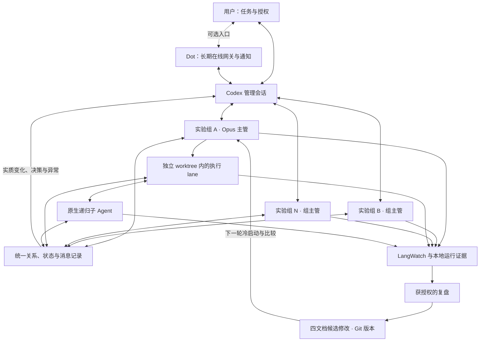

# Herdr Opus Workflow

**保留成熟的四文档开发流程，用 Codex 管理多组 Agent，以运行证据改进下一轮工作流。**

本项目衍生自 **白宦成（Bestony）** 的 [herdr-dispatch](https://github.com/bestony/herdr-dispatch)
及其[视频介绍](https://www.youtube.com/watch?v=CSbQEIB2roQ)。原方法在这条路径中采用
Claude 规划与调度、Codex 执行，通过 Herdr 工作区组织任务，并由主管独立验收。
其中已经写好的规划、任务书、执行、监督与验收细节，是本项目最重要的继承基础。
WXD7 在此基础上适配执行模型、补充实验与观测能力，并探索统一的会话管理机制。

> **当前定位：可分享、可继续开发的研究工程。** 默认分支包含 v1.3 开发版源码。
> 下文区分核心设计与实现现状；完整的事件升级、管理会话唤醒和恢复闭环尚未跑通。
> 不将它描述为已经稳定可用的全天无人值守产品。参见[能力现状](#能力现状)。

## 为什么继续改造

实际运行暴露出几类值得改进的问题：小任务可能反复调查、重复验收；Agent 已停下来
等待决定，管理层却不知道；不同层级间频繁确认，消耗了本应用于业务改进的 token；
模型、思考强度或提示词变了，却缺少可复现的比较依据。

原方法有价值，也有与新模型、新 harness 配置结合的空间。本项目保留其工程骨架，
将这些问题转成可观察、可比较、可回退的改进。效率提升需要证据，不能靠增加 Agent
数量或把模型换成更强的版本来推定。

## 核心思路

1. **四文档继续组织开发。** 原来的规划、任务书、执行、监督和独立验收仍是执行规范。
   管理入口和消息机制服务于这套流程，不再叠加另一套角色提示词框架。
2. **一个 Codex 管理会话统筹一个或多个组主管。** 在用户授权范围内管理分工、常规决策、
   异常升级与恢复。用户可以直接与它交互；需要时再接入 Dot。
3. **Dot 是可选的长期在线网关。** 它承接聊天、派发、跨时间通知和需要用户处理的事项。
   “24 小时监督”指服务与消息通道可持续在线，模型只在需要时工作，不是让模型不停巡检。
4. **把 A/B 思想扩展到 N 组实验。** 可以比较业务方案、模型／思考强度／子 Agent 配置，
   也可以比较四文档版本。一组独立完成一份方案，保留不同结果，最后按约定标准比较。
5. **以事件和消息钩子管理状态。** 让主管知道下属在工作、等子任务、等决定，还是出现异常。
   常态由程序维护状态；有实质变化才通知管理模型，避免反复读取长对话和无意义的模型心跳。
6. **用 LangWatch 和本地证据做事后复盘。** 将运行过程与代码、验收、人工介入和用量联系起来，
   提出有限的文档修改，再用新一轮隔离实验验证，形成有 Git 版本、可回退的改进。

## 目标架构

以下是项目要达到的关系，不代表图中每条消息链路均已实现。



Codex 管理会话是执行体系的上级；各组主管继续按原四文档运行。Dot 可以省略，
管理职责和消息关系仍然存在。最高管理层的权限来自用户授权，不覆盖平台本身的权限边界。
组内原生子 Agent 向直接父 Agent 返回结果，必要时逐层升级，不让每个子任务直接打扰用户。

目标是让每个停顿都有明确的责任人、原因和下一步。新权限或超出授权的事项可以等待用户，
但必须上报并保持可见，不能悄悄卡在底层。[完整架构与消息契约](docs/architecture.md)

## 三类实验，单组或多组都可以

| 实验方向 | 可以比较什么 | 应如何解释结果 |
| --- | --- | --- |
| 业务探索 | 同一问题的交互方式、实现策略、代码结构 | 用共同业务目标与各方案验收比较价值与代价 |
| 执行配置 | 模型、思考强度、原生子 Agent 开关与上限 | 尽量固定任务、代码起点、规则和环境，再比较质量、时间和总成本 |
| 四文档探索 | 原版与改版规划、任务书、监督或恢复规则 | 固定其他因素，检验某条规则是否减少重复工作或改善质量 |

同一场可以有一组、两组或 N 组；同时运行几组单独控制。每组有独立 worktree、分支、
会话和运行目录。配置过的服务由程序分配与回收端口，不让模型猜端口或解决抢占。
worktree 不等于容器，数据库、缓存和应用连接仍须使用本组配置。

当前表单支持多组模型／effort／四文档配置，并共享任务和验收字段；业务假设的独立分组
编辑与比较界面仍需完善。多因素一起改时，结果代表整套方案，不能归因于某一个模型或规则。
失败组、等待时间、复盘成本与证据不足项同样保留，不自动宣布优胜者。
[实验配置与启动](docs/experiments.md) · [协作与实验示例](docs/examples.md)

## 消息管理为什么是核心

统一机制要回答五个问题：**谁归谁管、当前在做什么、正在等谁、谁有权决定、决定是否真正生效。**
启动、进展、完成、提问、权限请求、异常与退出，都应进入同一套关系和状态记录。
界面是这份记录的可见视图，管理会话依据它行动，LangWatch 为之后的复盘提供证据。

一条需要处理的消息应留下完整过程：

```text
事件产生 → 指定上级收到 → 作出决定 → 原执行会话接收 → 实际恢复／明确失败
```

消息有任务、组、会话、规则版本和唯一 ID；需要去重、过期检查、有限重试和接收回执。
接收方不可用时保留待办并升级。程序可做低成本的状态核对，但不因此反复唤醒模型。
已发出、已收到、已决定与已恢复是不同事实；普通文字提问后结束回合，也不能被当成正常完成。
这些是统一机制的交付标准，当前已有的 DONE 和 lane 决策传输只覆盖其中一部分。

## 用证据持续改进四文档

```text
执行任务 → LangWatch／本地记录 → 有范围的复盘 → 小幅规则修改
       → 版本化与冷启动 → 隔离对照实验 → 采纳、保留或回退
```

先核对真实会话身份、父子关系和采集覆盖，再评价重复调查、等待、验收质量与总消耗。
包括失败尝试、监督、复盘和人工介入；缺失数据记为未知，订阅账单不等于 token 估价。
复盘可按授权使用 GPT-6 Astra，但不会默认启动额外的模型巡检或递归观察器。

“进化”指工作流规则随证据迭代，不是训练模型权重，也不是自动放宽权限。
当前没有无人值守的自动改写、自动采纳或自动回退规则系统。
[观测工具](observability/README.md) · [LangWatch 接入](observability/langwatch/README.md) ·
[复盘契约](observability/astra-review-contract.md)

## 能力现状

| 能力 | 目前状态 |
| --- | --- |
| 原四文档、Opus 适配与原生子 Agent 配置 | 已有代码与版本记录；模型和 CLI 能力须在实际账号验证 |
| N 组配置、worktree／分支隔离、配置冻结、服务端口管理 | 已有本地 UI／CLI／MCP 实现与合成验证；仍是开发版 |
| 完成通知、lane 到主管的决策请求与回执 | 已有部分实现；真实试跑暴露主管登记缺失等问题，不能宣称全链路可用 |
| Codex 管理层的统一会话关系、完整状态分类和异常升级 | 已明确设计，尚未完成统一实现和端到端验收 |
| Dot 的工具接入与事件接口 | 已有本地接口；长期在线网关、实际事件唤醒与恢复链路待接通验证 |
| LangWatch／本地证据采集与受控复盘 | 已有工具；完整子代覆盖、部分用量与实际配置可能未知 |
| 全天无人值守、自动审批、自动规则进化 | 不作为当前能力承诺 |

本地最近一次消息测试暴露了三类缺口：主管用普通文字等待确认却被看作空闲；执行者
提出问题但找不到已登记上级；本地阻断事件没有真实订阅者接收。项目保留这些失败结论，
下一步应按统一机制修整，不能靠更多业务试跑或更频繁的模型巡检掩盖。
[开发版验证与限制](docs/release-v1.3.md) · [Dot 接入边界](docs/dot-connection.md)

## 四份核心文档与上手入口

| 文件 | 职责 |
| --- | --- |
| [SKILL.md](source/herdr-dispatch/skills/dispatch-codex/SKILL.md) | 入口、边界、加载路径 |
| [plan.md](source/herdr-dispatch/skills/_shared/plan.md) | 需求、分工、任务书、验收与交付约定 |
| [supervise.md](source/herdr-dispatch/skills/_shared/supervise.md) | 监督、证据复用、独立验收、交付 |
| [driver.md](source/herdr-dispatch/skills/dispatch-codex/references/driver.md) | 执行配置、状态读取、审批与恢复 |

本项目默认执行配置为 Opus 5.5 / max，允许原生子 Agent，默认每个 harness 并发上限 3、
递归深度上限 3。这些是上限，不是必须创建的数量。原生命令仍为
`/herdr-dispatch:dispatch-codex`，兼容名称保留；配置实验使用明确模型 ID，没有静默降级。

```sh
git clone https://github.com/WXD7/herdr-opus-workflow.git
cd herdr-opus-workflow
./scripts/start-claude.sh --check
```

这一步检查入口配置，不调用模型，也不证明账号、遥测或消息闭环可用。
[本地准备](docs/setup.md) · [实验 UI／CLI](docs/experiments.md) · [可选 Dot 连接](docs/dot-connection.md)

新规则通过新会话加载，记录实际插件、Git 版本与四文档哈希。保留历史标签以支持回退；
不要把恢复旧对话当作加载了新机制。本次发布重点是共享源码和设计，未发布新的稳定版标签。
[四文档版本历史](source/herdr-dispatch/WORKFLOW-VERSIONS.md)

## 来源、许可与协作

- 原方法与插件：[白宦成（Bestony）](https://github.com/bestony) /
  [herdr-dispatch](https://github.com/bestony/herdr-dispatch)，保留其 [MIT 许可](source/herdr-dispatch/LICENSE)。
- 改编、Opus 适配、配置实验和观测整合：WXD7。独立维护，不代表原作者或相关产品官方认可。
- [LangWatch](https://github.com/langwatch/langwatch) 为独立观测项目；所提取代码保留
  [来源哈希](observability/langwatch/instrumentation/upstream-source.json)与[许可](observability/langwatch/instrumentation/LICENSE.langwatch)。
- 原创增补采用 [MIT](LICENSE)。[v1.2 阶段图](docs/assets/workflow-evolution-v1.2.png)与
  [ImageGen 图示说明](docs/assets/imagegen-prompt.md)保留为方法演进记录；当前关系以本文架构为准。

欢迎围绕统一消息机制、会话管理、隔离实验和基于证据的规则改进交流与贡献。
贡献时说明改动假设、验证证据与未知项；保留四文档的工程价值，不靠文档膨胀取代程序机制。
仓库仅分发 workflow、插件、适配器和合成示例，不分发业务项目、真实会话、运行数据库或凭据。
