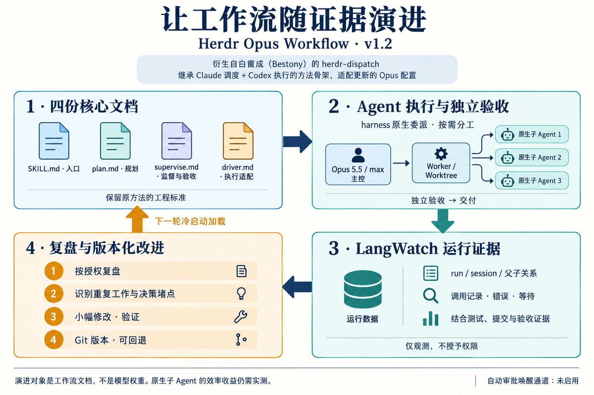

# Herdr Opus Workflow

**从白宦成（Bestony）的原生方法出发，让多 Agent 工作流随运行证据演进。**

本项目衍生自白宦成的 [herdr-dispatch](https://github.com/bestony/herdr-dispatch)
与其[视频介绍](https://www.youtube.com/watch?v=CSbQEIB2roQ)。
原方法中 **Claude 规划与调度、Codex 执行、Herdr 隔离工作区、主管独立验收**
的工程骨架，以及已经写好的规划、执行和验收细节，是本项目的起点与主要继承价值。
原作者另提供 Grok / OpenCode 驱动；本项目重点改造原 `dispatch-codex` 路径。
这不是重新发明一套启动器或提示词体系，而是 WXD7 在原生方法上的适配与改进。

原方法面向它发布时的模型与配置。实际运行后，我们发现还有可以调整的空间：
小任务也可能重复调查与验收、完成通知与审批可能造成等待、主管可能把本可自行决定的
恢复步骤上交给人，以及运行证据不足以支持“效率更高”的判断。
随着模型和 harness 能力更新，执行配置也值得重新验证；这些观察并不说明原方法无效。

本地使用配置更新为 **Claude Opus 5.5 / max**，并开放 Claude Code harness 的
**原生子 Agent**：worker 可在任务边界内自主委派，由父 Agent 汇总。
这使局部任务分配、信息传递与结果整合可以留在同一套原生运行机制中，
预期减少跨执行器协调的阻力。**这是设计假设，尚无受控对照证明更快、更省 token，
也不代表子 Agent 越多越好。** 模型可用性和原生环境变量支持必须在使用者的 CLI 上确认；
没有静默降级。这里描述本项目选用的更新配置，不声称是任何时点的“最新最强”。



图中的“演进”是：依据任务记录提出小幅规则修改，验证后形成可回退版本，
由下一轮新会话加载。**它改变工作流文档，不训练模型权重，也不自动授予权限。**
LangWatch 收集证据；复盘与采纳仍按授权进行。

## 继承什么，改进什么

| 层次 | 继承的基础 | 本项目的适配 |
| --- | --- | --- |
| 规划与验收 | 原任务书、lane、独立验收、约定交付 | 保留四文档结构；小任务少分工、复用有效证据，不削弱原始需求 |
| 执行 | Claude 主管调度 Codex 的这条原路径 | 默认 Opus 5.5 / max；v1.3 实验组可选显式模型、effort 与文档版本 |
| 任务隔离 | Herdr pane / worktree / 分支 | 每组独立 worktree／分支／运行目录；已配置服务由本地程序分配端口 |
| 决策与恢复 | 监督、通知、恢复流程 | v1.2 明确决策归属、异常分类、有限恢复与副作用核对 |
| 观测 | 会话与任务状态 | LangWatch + 精确 run/session 关联 + 本地去重证据 |
| 持续改进 | 成熟的约束文档 | 按授权复盘 → 小改动 → 验证 → Git 版本与回退 → 新任务加载 |

四份核心文档继续作为唯一调度规范：

| 文件 | 负责什么 |
| --- | --- |
| [SKILL.md](source/herdr-dispatch/skills/dispatch-codex/SKILL.md) | 入口、边界、加载路径 |
| [plan.md](source/herdr-dispatch/skills/_shared/plan.md) | 需求、分工、任务书、验收与交付约定 |
| [supervise.md](source/herdr-dispatch/skills/_shared/supervise.md) | 监督、证据复用、独立验收、交付 |
| [driver.md](source/herdr-dispatch/skills/dispatch-codex/references/driver.md) | Opus 执行配置、状态读取、审批与恢复 |

## v1.3 开发版：可比较的配置实验

同一任务可以单组执行，也可以配置 N 组独立完成。浏览器表单、自然语言修改和 Dot 的
MCP 工具使用同一份草稿、队列与证据；开始时固定代码提交、四文档内容和执行配置。
组数、同时运行组数、组内原生子 Agent 上限分别设置。不会自动调用 Astra、改写规则或宣布优胜者。

[配置界面与本地启动](docs/experiments.md) · [Dot 接线](docs/dot-connection.md) ·
[验证范围](docs/release-v1.3.md)

本开发版包含接口与合成测试；真实 Herdr 多模型实验、账号模型权限和 Dot 事件唤醒
尚需在已连接环境验证。旧 v1.2 标签保留；不要把本地接口通过称作 Dot 已接通。

## v1.2 已有规则

- **决策有人负责**：主管决定已授权范围内的常规实现与恢复；只把指定异常交给获授权的复盘者。
  扩大范围、预算或权限，以及降低验收要求，仍由用户决定。
- **识别真正的停滞**：API 报错需要及时诊断；长测试不因耗时被中断；
  `mtime`、`away_summary` 或重复汇报不算业务进展。
- **恢复有边界**：先确认工具是否仍在运行、上次操作有无副作用；有限续跑，避免重复执行。
- **验收不缩水**：同时对照原始需求和 lane 标准，区分事实、推断与未查明原因。
- **规则保持克制**：尽量替换旧句、合并重复约束，四文档总篇幅不超过 v1.1。

这些是已经写入文档的调度规则。**v1.2 未包含可用的自动审批/唤醒桥，也未完成新版本
端到端业务实跑。** 原生 `/goal` 未启用；影子门控不会自动调用 Astra；
没有无人值守的自动改写、自动采纳或“永不卡住”的保证。
[完整版本与回退说明](source/herdr-dispatch/WORKFLOW-VERSIONS.md) ·
[发布验证](docs/release-v1.2.md)

## 从这里开始

```sh
git clone https://github.com/WXD7/herdr-opus-workflow.git
cd herdr-opus-workflow
./scripts/start-claude.sh --check
```

这一步只展示模型、子 Agent 环境与插件配置，**不调用模型，也不证明账号可用或遥测已接通**。
实际使用依赖 Herdr、官方 Claude Code 登录与模型权限、zsh、Python 3.13、Node.js，
本地 LangWatch 另需 Docker。当前入口以项目内的 `demo/` 为起点，不能不经配置就用于任意外部仓库。

随后阅读 [本地准备与启动](docs/setup.md)，在真实 Herdr pane 中开启全新会话，
使用原命令 `/herdr-dispatch:dispatch-codex`。新规则不会热更新到旧会话；
启动时记录插件路径、Git 版本和四文档哈希。不要用 resume 冒充升级。

三个合成示例见 [examples.md](docs/examples.md)：
小范围清理、独立函数开发，以及根据一轮任务证据改进工作流。
示例是使用方法，不是性能基准或成功率报告。

## 观测与演进

[观测说明](observability/README.md) ·
[LangWatch 配置](observability/langwatch/README.md) ·
[复盘契约](observability/astra-review-contract.md)

用任务是否验收通过、缺陷、人类介入、完成时延和包含失败尝试的成本共同评价。
区分输入、缓存与输出，不用工具调用次数推算 token 浪费，不把费用估价当订阅账单。
原生子 Agent 与独立 worker 的关系应以实际记录核对，覆盖不完整时明确保留未知。

默认一次复盘针对一个明确范围，最多提出三个可验证候选；同一证据不重复分析。
当前采集、影子规则和证据包工具可以本地运行，v1.3 已增加事件订阅接口；实际云端连接需要部署与注册，规则自动采纳仍未启用。

## 来源、许可与公开范围

- 原方法与插件：[白宦成（Bestony）](https://github.com/bestony) /
  [herdr-dispatch](https://github.com/bestony/herdr-dispatch)，保留 [MIT 许可](source/herdr-dispatch/LICENSE)。
- 改编、Opus 适配与观测整合：WXD7；本项目独立维护，不代表原作者或相关产品官方认可。
- [LangWatch](https://github.com/langwatch/langwatch) 是独立观测项目；
  本仓库提取的 npm 纯函数保留[来源哈希](observability/langwatch/instrumentation/upstream-source.json)
  与[对应许可](observability/langwatch/instrumentation/LICENSE.langwatch)。
- 原创增补代码与文档采用 [MIT](LICENSE)。图由 ImageGen 生成并人工检查，
  [图示说明与提示词](docs/assets/imagegen-prompt.md) 随仓库提供。

仓库分发 workflow、插件、采集适配器、配置和合成示例；
不分发业务代码、实际会话、运行报告、凭据、数据库或登录状态。
旧 Git 历史保留原有来源信息和本机路径，不能当成可复制部署参数。
