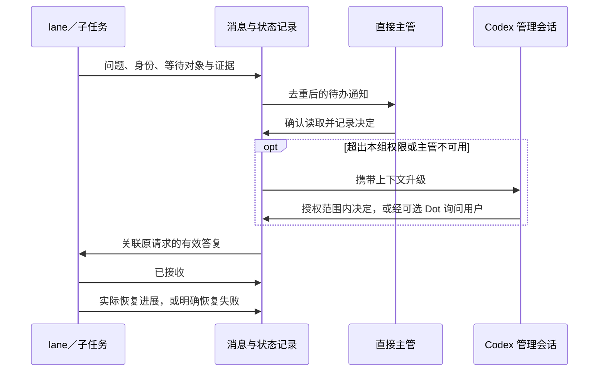

# 架构理念：可管理、可比较、可复盘的 Agent 工作流

本说明解释项目的设计方向，供协作开发和评审使用；不是第五份执行提示词。
执行标准仍来自白宦成（Bestony）原方法衍生的[四文档](../README.md#四份核心文档与上手入口)。
**以下关系与消息契约是目标设计，当前实现仅覆盖一部分。**

## 1. 管理关系与可选入口

```text
用户 ───────────────→ Codex 管理会话
  └→ Dot（可选网关）───────┘
                         ├→ 实验组 A 主管 → 执行 lane → 原生子 Agent
                         ├→ 实验组 B 主管 → 执行 lane → 原生子 Agent
                         └→ 实验组 N 主管 → 执行 lane → 原生子 Agent
```

用户面对一个明确的管理入口，授权目标、范围、预算与验收。Codex 管理会话统筹各组，
处理已授权的跨组协调和异常；组主管沿用原四文档做规划、分工、恢复和独立验收。
lane 是执行单元；原生子 Agent 是 harness 内的协作者，其结果先返回直接父 Agent。
层级表示责任归属，不要求每个小任务都创建所有层级或开启子 Agent。

Dot 可以承担长期在线的聊天、派发、通知和人工升级入口，也可以不接入。
直接使用 Codex 管理会话或 Herdr 发起任务，目标上应进入同一份任务与关系记录。
“24 小时”描述消息服务的可用性目标，不承诺模型持续运行，也不意味着关闭客户端后
本地任务仍自动存活。目前尚未完成这几种入口之间的统一管理和实际唤醒验证。

| 层级 | 负责决定什么 | 何时向上报告 |
| --- | --- | --- |
| 用户／直接交互入口 | 目标、授权范围、预算、交付边界 | 用户给出新要求或答复 |
| Codex 管理会话 | 授权范围内的协调、例外处理、是否继续某组 | 新权限、范围、预算或验收变化超出既有授权 |
| 组主管 | 实现路径、任务分配、常规恢复、独立验收 | 无法在本组权限内解决，或需要管理层协调 |
| lane／原生子 Agent | 已委派任务内的实现与验证 | 缺少必要条件、出现风险、失败或完成 |

管理会话拥有工作流中的上级管理权，仍须遵守用户和运行平台的权限边界。
已经授权的常规技术决定应由负责的 Agent 解决，不重复让人拍板；确需用户批准时，
将原因、待选方案和影响合并上报。不能通过自动输入“同意”绕过平台审批。

## 2. N 组实验与隔离

一份任务可以单组执行，也可以用 N 组探索，组数和同时运行组数分别配置。
每组保存业务代码起点、任务与验收、执行配置、四文档版本以及实际运行身份。
用户在启动前看到这些配置和差异；自然语言只修改同一份可见配置，不生成隐形的第二套规则。

| 比较轴 | 例子 | 需要固定或记录的条件 |
| --- | --- | --- |
| 业务方案 | 集中审核面板与分步确认；局部整理与结构重构 | 共同业务目标、各方案边界与验收 |
| 执行配置 | 同模型 max 与 medium；不同模型；子 Agent 开关 | 代码起点、任务、规则、环境与并发资源 |
| 四文档 | 原版与候选版监督规则 | 其余配置固定，记录具体变更与假设 |

组是完整的候选方案，lane 是组内分工，两者不能混为一谈。不同组不能共享可写业务目录，
也不能把另一组的实现无记录地搬过来再称为独立结果。合并哪一组是实验之后的决定。
同时改变多个因素可以探索组合，但不能据此断言某一个因素带来了提升。

代码用独立 worktree／分支隔离，运行数据、缓存、构建目录和服务配置按组分开。
端口由程序分配、登记、校验所有权并有限重试，不消耗模型去猜端口。
worktree 不是容器；应用必须使用本组数据路径和服务配方，硬编码共享资源仍需接入时处理。

当前 UI／CLI／MCP 已实现 N 组执行配置与四文档选择，任务与验收仍为共享字段。
独立业务假设字段、跨入口统一管理和完整比较视图仍需完善。旧规则配合当前适配器，
不等于重演当年的全部环境；选定规则哈希与适配器版本分别记录。

## 3. 统一关系、状态和消息

核心问题是：**谁归谁管、在做什么、正在等谁、谁能决定、决定是否生效。**
目标是一份可追溯的关系与状态记录，由 UI、Codex 和可选 Dot 读取；不让每个入口维护
互相矛盾的进度。LangWatch 提供过程证据，不充当决策收件箱或运行控制器。

最低限度的记录应包含：

- 身份与归属：任务／实验／组、Agent 与父 Agent、会话和执行位置、配置与规则版本。
- 当前状态：工作中、等待子任务、等待决定、等待权限、疑似停滞、失败、待验收、完成、已停止；
  同时保留原因、等待对象、最后实质进展和原始状态来源。未知身份必须显式显示。
- 消息凭据：唯一事件 ID、请求与答复的关联 ID、指定收件人、有效期、各阶段回执和错误。

这些是设计要求，并非已经统一落地的数据库字段或状态枚举。原生子代不必都拥有
Herdr pane，但要能从 harness 证据关联到父会话；关联缺失记为未知，不猜测归属。



**事件写入、传输送达、上级读取、作出决定、下级接收、实际恢复是不同事实。**
只有事件文件或 HTTP 2xx，不能声称管理会话已被唤醒；只有接收回执，也不能声称工作恢复。
普通文字提问后结束回合不能直接算完成；任务完成还需交付与验收证据。

消息处理应持久化、去重、限制重试并校验会话与版本。重启可恢复未完成待办；过期答复、
跨组答复和旧会话消息不能落到新任务。找不到收件人时保留问题和失败原因，向指定管理层
升级；没有可用管理层就保持可见待处理，不改投一个“最近打开”的对话。
决策与输入传输结果不确定时先核对，不盲目重发可能有副作用的指令。

## 4. 低 token 的监督策略

优先使用 harness 钩子、进程生命周期和结构化完成／决策事件；程序处理身份登记、队列、
去重、时限和状态变化。缺乏原生事件的部分允许有限的确定性核对，以发现丢失事件和失联。
程序核对不调用语言模型；只把需要判断的变化整理成紧凑证据包交给管理会话。

相同状态合并，不重复唤醒；正常构建、测试或等待子任务不能仅因耗时被判为卡住。
对缺少事件、缺少登记或无法识别的文字提问，要报告覆盖缺口并补采必要证据，
不能默默显示绿色，也不能通过无限加密模型巡检补救。

目标不是消除所有等待，而是让等待有原因、有责任人、有升级出口，且能核实是否恢复。
在线监控成本要计入实验，不能只统计业务 worker 的用量。

## 5. 证据如何反馈到四文档

LangWatch 与本地记录关联运行身份、父子关系、配置、提交、验收和用量覆盖。
获授权的复盘读取必要片段，区分事实、推断与未知，观察重复调查、错误等待、过度分工、
质量缺陷、人工介入及总消耗。没有完整覆盖时不虚构节省比例。

每次候选改动说明问题证据、假设、目标规则和预期效果；优先替换或删减冗余约束，
不把运行时通信故障全写成更多提示词。候选通过 Git 提交和四文档哈希管理，在新会话中
装载，与基线隔离比较后再决定采纳或回退。旧会话不会因文件变化自动升级。

这个循环改进的是工作流规则与实现，不是训练模型权重；当前没有自动采纳规则的执行器。
[观测与评价方法](../observability/README.md) · [版本管理](../source/herdr-dispatch/WORKFLOW-VERSIONS.md)

## 6. 实现地图与下一步验收

| 当前代码 | 已有基础 | 尚缺什么 |
| --- | --- | --- |
| `experiments/config.py`、`snapshots.py`、`engine.py` | 配置、冻结、组隔离与队列 | 独立业务假设的完整配置与比较 |
| `experiments/resources.py` | 服务配方、端口和进程所有权 | 各业务应用正确使用隔离配置的实证 |
| `experiments/lifecycle.py`、`decisions.py` | 登记进程的收尾、DONE、lane ↔ 主管决策 | 可靠主管登记、完整状态与顶层管理关系 |
| `experiments/events.py`、`bridge.py` | 本地 MCP 与有界事件投递 | 真实订阅、管理会话唤醒与答复恢复闭环 |
| `observability/` | 遥测、采集、有限复盘证据包 | 完整覆盖验证与稳定的端到端关联 |

最近实跑发现：普通文字待确认被视为空闲、请求无法找到已登记主管、本地事件没有实际
订阅者。已有合成回归未能证明这些链路在真实会话中可靠。[验证记录](release-v1.3.md)

后续应围绕统一机制验收，而不是再增加孤立提示词补丁：

1. 从启动到退出核对主管、lane 和可观测原生子代的真实归属，缺失必须显示。
2. 对常规决定、权限请求、主管失联、普通文字提问和长任务分别验证识别与升级。
3. 实测每跳回执和恢复证据；断线、重复事件、重启、过期答复不丢待办、不重复执行。
4. 分别验证直接 Codex 和可选 Dot 路径；拔掉 Dot 后核心管理关系仍成立。
5. 比较管理用量、等待、人工介入与最终质量；发布可复查的合成证据，不发布真实业务会话。

这些是后续工程的完成标准。本次公开快照集中共享方法、源码与已知边界，不承诺已经实现。
