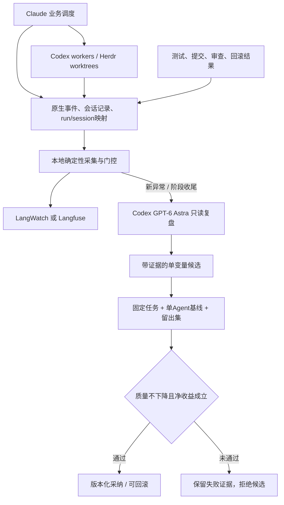

# Herdr 运行观测与受控优化：评估及第一阶段原型

> 当前配置：原 herdr-dispatch 工作流的执行器已适配为 Opus 5.5 / max，LangWatch 负责采集；Astra 只允许每次确认范围后调用。详见 [恢复原系统报告](../evidence/restore-original-20260927/report.md) 和 [LangWatch 接入记录](langwatch/README.md)。以下为历史研究与 Codex 基线；其中事件触发、优化闭环和预算均不是当前自动执行流程。

基于 [分享讨论](https://chatgpt.com/share/6ab89a4a-6568-83ea-a899-788774ad33ee) 与本次真实运行 `tm09ut`。本目录新增在全新工程内部；原版源码、官方登录、现有工作区、已完成运行状态均未改动。没有复用分享讨论中引用的 Ponora 旧配置，也没有向 LangWatch/Langfuse 上传数据。

**建议采用：原版 Herdr/Claude/Codex + 确定性本地事件与关联层 + 一个观测平台（优先验证 LangWatch）+ 按需 Codex GPT-6 Astra 复盘 + 固定任务对照验证。** 原版已有监督与验收，但没有完整的流程自优化闭环。

## 已经取得的真实数据

来源：[可复核的基线分析](research/baseline-findings.md)、[规范化快照](runs/tm09ut/run-summary.json)。只读了 state 指明的主管会话、两个 worker，以及数据库中实际父子边关联的两个审查子会话。未读取不相关历史项目。完整性限于这些本地文件，不含安装代理、本次研究代理、未写入这些文件的服务端请求或账户级开销。

| 对象 | 已确认记录 | 正确理解 |
| --- | --- | --- |
| Claude 调度器 | 133 条 assistant 行对应 33 个 message ID；69 个工具调用 | usage 必须按消息 ID 去重；工具数量不等于 token 归因 |
| Claude 用量 | input 876；cache creation 149,160；cache read 3,436,339；output 71,912 | 四种计量分别保留；缓存读不是等额的新输入费用 |
| 文本 worker | 446,581 总 token，其中 411,392 为缓存输入 | 来自逐响应去重用量，与该线程最终累计一致 |
| 数字 worker | 519,429 总 token，其中 478,336 为缓存输入 | 直接累加 `last_token_usage` 会多算 27,514 |
| 两个 worker 的审查子会话 | 分别 103,306、149,261 总 token | 已按真实父子关系关联，不可漏掉，也不可重复加已聚合子账 |
| 两个 goal 的另一计量口径 | 43,929、50,662 | 合计 94,591 **不是完整模型调用总 token**，不与上列相加 |
| 验收 | 两任务分别 6/6、7/7，两个提交、两个实现文件 | 原有测试未变；验收结果为历史证据，本次采集没有重跑业务测试 |
| 协调行为 | 5 次审批（3 次提交相关、2 次通知）；2 次完成通知；4 个巡检时间点 | 其中有一次提交锁竞争重试；不能仅凭次数认定无价值 |

四条 Codex 线程共 46 个唯一 response ID，没有跨线程重复；总计 1,218,577 token，其中缓存输入 1,120,384。这里允许汇总的前提是逐线程响应去重、父线程文件没有包含子线程 usage。不能把此数字当实际订阅账单，也不能与 goal 计量再相加。

**目前不能给出“多少百分比浪费”的结论。** 业务执行、监督、验证常在同一个响应里发生；工具调用次数或时间比例不能代替准确 token 归因。尤其本次 5 分钟 Cron 没有实际触发证据，不能据此指控心跳是这次的主要 token 来源。确实发生的低效候选包括一次 18×5 秒轮询、通知审批等待，以及明知另一 TODO 未实现仍做的信息性完整测试。

## 分享方法的接入评估

| 方法 | 决定 | 还需要补什么 |
| --- | --- | --- |
| LangWatch | 优先小规模接入验证 | 保留官方订阅登录；核对实际上传字段/末轮与中断覆盖；对接 Herdr run/session 与验收结果 |
| Langfuse | 完整备选，不同时部署两套 | Stop hook 以回合后采集为主；同样需要跨终端关联和客观质量数据 |
| Claude/Codex OTel、Hooks、原生 transcript | 数据入口 | 原生子代理与独立 Herdr worker 是不同关系；按 ID 映射，不能靠“最近的会话”猜 |
| 上下文清单 | 应接入 | 保存任务/规则/Skill hash、实际激活证据、模型/推理强度/权限/工作目录；明确 observed 与 model_reported |
| Codex GPT-6 Astra 复盘 | 应接入，按事件与阶段调用 | 先给聚合数和证据索引，按需取小片段；记录观察器自身成本；一次最多三个可检验建议 |
| GEPA | 后置 | 需要可重复 evaluator、代表性任务与留出集、预算；优化候选不等于已经证明有效 |
| Claude Hooks 单栈监控小项目 | 作为参考 | 单独使用不能完整覆盖 Codex + 跨终端 + 验收链 |
| Agent Lightning | 当前不引入 | 当前问题是运行规则/协调效率，无需先引入模型权重训练体系 |

详细官方资料与限制见 [平台适配表](research/platform-fit.md)。LangWatch 有两种 CLI 的订阅遥测接入和 agent 查询 CLI；但默认可能发送会话正文，instrument 也可能修改全局配置/notify/hooks。接入前应对配置做差异合并、用合成内容验证目的地与 payload。本次未安装这些集成。

本机已确认 Docker Server `29.7.2` 可响应，物理内存 48 GiB、18 个逻辑 CPU，资源名义上满足 LangWatch 文档的试跑前提。并未做实际容量/竞争测试。LangWatch Compose 是多个服务，包含数据库与后台任务；不应为了监控挤占业务测试的资源。

## 建议的监督与优化闭环



确定性采集可以频繁发生，**频繁检查不必对应频繁 LLM 调用**。本地进程/事件检查承担机械工作；保留低频静默故障兜底，避免通知丢失后无人发现。恢复决策仍由有权限的业务调度者处理，Astra 更适合跨运行归因与优化，不必插进每次审批。

需要定制的是薄关联层与评价契约，不是重新开发完整观测平台：

- 标识：`task_id / run_id / attempt_id / agent_session_id / turn_id / handoff_id / parent / commit`；支持独立终端和原生子代理两类边。
- 证据：原始事件引用、规则与 Skill 版本、模型/权限/阶段分别记录。任务开始、交接、压缩、恢复、验收这些关键点保存清单；不在每次工具调用复制全文。
- 结果：测试实际执行及退出码、tested HEAD、审查缺陷、取消/超时/失败/回滚、人类介入。模型自称完成只是一个事件。
- 自我修正：一次改变一个规则或参数；候选不得改权限、删除验收、放宽测试或抬高自己的预算；复测失败则拒绝。生产自动采纳与回滚执行器尚未实现。

评价先保证验收质量和缺陷不回退，再比较“所有尝试的总成本 / 验收通过任务数”、时延与人类介入。分母为零时不能显示为零成本。失败、重试、监督、观察器与实验开销都应纳入各自账本；订阅支出、配额消耗与按 API 价估算分开。

## 第一批候选实验

| 候选 | 为什么值得试 | 保留的质量约束 |
| --- | --- | --- |
| 本地检查取代无变化的 LLM sweep；有行动价值才唤醒 | 原版每次 sweep 要重新阅读状态、探针、部分 pane | 注入丢通知/工具长运行/进程退出故障，测漏报与恢复时延；不能仅测节省 |
| 固定格式完成事件通过受限通知通道投递 | 本次两次 notify-back 都遇到审批 | 不扩大 worker 权限；队列幂等、收件人校验、成功回执与失败兜底 |
| 微任务用单 worker，与双 worker/内置审查子代理对照 | 本次两个很小的函数也产生两个额外审查会话 | 独立验收、相同起点、模型配置与留出任务保持一致；不能把取消审查本身算优化收益 |
| 去掉已知无意义的跨 lane 完整测试与重复日志读取 | 原版试跑信息性 discover 产生预期失败 | 每条 lane 的有效验收命令与最终独立复测保留 |

以上都是 hypothesis，尚未完成 A/B 对照。两个玩具任务不足以证明复杂项目也适用。

## 本次已经落地的原型

- `collect_run.py`：标准库、本地只读、沿精确 ID 和父子边收集；消息/响应去重；冲突、缺记录、累计重置保留为覆盖率信息。一次真实采集约 14 ms，0 LLM、0 网络调用。这是一次性全文件快照，尚非增量 daemon。
- `gate.py` + `observer-policy.json`：纯影子回放。抑制无变化心跳、重复证据、观察器自触发、已有处理动作和终态后事件；未知/过期的工具活动证据不能判作停滞。
- `make_review_packet.py`：只生成有限元数据与证据索引，本次 packet 约 13.4k 字符。超过 24k 字符时失败，不偷偷截断。没有自动调用 Astra。
- `astra-review-contract.md`：Astra 的输入/输出及候选验证约定；本次已由明确指定 GPT-6 Astra 的只读子代理完成基线与架构审查，但未启动常驻观察器。
- 18 项原型检查通过；105 条**合成事件**回放产生 2 个复盘候选、0 次 LLM 调用，其中 100 次 heartbeat 全被抑制。这个合成结果不是实际节省比例。

原型审查也发现并修复了两项监测错误：被排除的观察器事件不应锁存业务终态；没有采到活动状态不应被当作“确认没有活动”。相关回归检查已保留。

策略里的 10 分钟停滞阈值、15 分钟冷却、每 run 两个候选等均是**待校准起点**。影子门控没有真正发送工作、实施审批或执行硬 token 限额；未来正式调度还需持久队列、原子配额预留、幂等 ack、超时及观察器单独计量。默认观察模式不会改原工作流。

## 复现命令

从工程根目录运行：

```sh
python3 observability/collect_run.py --state evidence/final-run/state.json --out observability/runs/tm09ut
python3 observability/make_review_packet.py observability/runs/tm09ut/run-summary.json --out observability/runs/tm09ut/astra-review-packet.json
python3 observability/gate.py observability/tests/fixtures/shadow-events.jsonl --out observability/runs/shadow-demo/decisions.json
python3 -m unittest discover -s observability/tests -v
```

下一阶段应做 LangWatch 的隔离接入试验：两 CLI 官方订阅保持不变；核对上传内容与 ID 关联；验证最后一轮、失败/取消/恢复、不重不漏；用本地 collector 对账；采集服务故障不能让业务任务被误判。之后再接 Astra 单次复盘执行器与固定任务对照。原版还保留在 `source/herdr-dispatch/` 作为对照。

## 参考与审查记录

- [原版监控、修复机制与源码定位](research/architecture-review.md)
- [真实数据、覆盖范围与计量陷阱](research/baseline-findings.md)
- [现成组件官方资料适配](research/platform-fit.md)
- [Codex OTel 配置](https://learn.chatgpt.com/docs/config-file/config-advanced)
- [Claude OTel 与原生事件](https://code.claude.com/docs/en/monitoring-usage)
- [GPT-6 Astra 官方模型标识](https://developers.openai.com/api/docs/models/gpt-6-astra)

文档中的平台能力来自官方资料；“本机已接入”只有完成上述接入验收后才能成立。当前交付是有真实数据支撑的接入评估、可重复本地采集、影子门控和受控优化设计。
